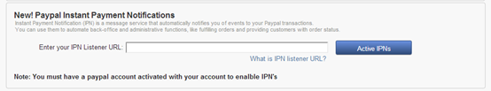
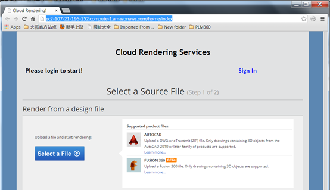
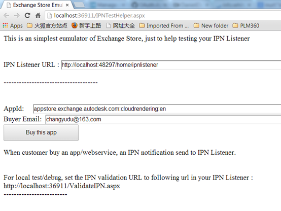

Copyright (c) Autodesk, Inc. All rights reserved 

Permission is hereby granted, free of charge, to any person obtaining a copy of
this software and associated documentation files (the "Software"), to deal in
the Software without restriction, including without limitation the rights to
use, copy, modify, merge, publish, distribute, sublicense, and/or sell copies of
the Software, and to permit persons to whom the Software is furnished to do so,
subject to the following conditions:

The above copyright notice and this permission notice shall be included in all
copies or substantial portions of the Software.

THE SOFTWARE IS PROVIDED "AS IS", WITHOUT WARRANTY OF ANY KIND, EXPRESS OR
IMPLIED, INCLUDING BUT NOT LIMITED TO THE WARRANTIES OF MERCHANTABILITY, FITNESS
FOR A PARTICULAR PURPOSE AND NONINFRINGEMENT. IN NO EVENT SHALL THE AUTHORS OR
COPYRIGHT HOLDERS BE LIABLE FOR ANY CLAIM, DAMAGES OR OTHER LIABILITY, WHETHER
IN AN ACTION OF CONTRACT, TORT OR OTHERWISE, ARISING FROM, OUT OF OR IN
CONNECTION WITH THE SOFTWARE OR THE USE OR OTHER DEALINGS IN THE SOFTWARE.

## How Exchange IPN Listener works and how to create an IPN Listener

  

- I am going to sell my web services on Autodesk Exchange. As a web service publisher/seller, I would like to get a notification when someone buys my web service from Exchange, so that I can create an account and grant access to him. Instant Payment Notification (IPN) is a message service that automatically notifies merchants of events related to PayPal transactions. Merchants can use it to automate back-office and administrative functions, like fulfilling orders and providing customers with order status. Now Autodesk Exchange supports IPN notification. For priced web service, Autodesk Exchange relays the IPN notification to the publisher, adding some additional information, such as the buyer’s email address. For free web service, Autodesk Exchange sends an IPN notification to publisher including necessary information including buyer’s email address, etc.  

- Firstly, let’s take a look at how to setup IPN listener. If you go to “My Upload” in Exchange by clicking the up-arrow button near your account name in up-right corner, you will see an new UI like below. You can input your IPN listener ULR and activate IPNs so that you can receive IPN notification and handle them according to your business logic. If you do not know what IPN is, please refer to https://developer.paypal.com/webapps/developer/docs/classic/ipn/ht_ipn/.    

                            

- Now, you can go ahead to publish your web service to Autodesk Exchange. For web service, you can just specify your web service URL. For example, I have a web service – cloud rendering, allowing users uploading models and rendering them in cloud. My web service url is : http://ec2-107-21-196-252.compute-1.amazonaws.com/home/index



- To use my service, user need to login to my website. When user buys my web service from Autodesk Exchange, I get the IPN notification from Exchange. My IPN listener receives this notification and creates an account for this buyer, and sends the account information to buyer so that he can use my service. 
- Now I will create my IPN listener, it is an asp.net MVC application, my IPN listener is : ec2-107-21-196-252.compute-1.amazonaws.com/home/IPNListener, here is the code: 

```csharp
public void IPNListener()
 {
   string ipnNotification = Encoding.ASCII.GetString(Request.BinaryRead(Request.ContentLength));
   if (ipnNotification.Trim() == string.Empty)
   {
     NetLog.WriteTextLog("No IPN notification received. ");
     return;
   }
   NetLog.WriteTextLog(ipnNotification);
 
   string validationMessage = HandleIPNNotification(ipnNotification);
   NetLog.WriteTextLog(validationMessage);
 }
```


 


For the format of IPN notification, you can refer to https://developer.paypal.com/webapps/developer/docs/classic/ipn/integration-guide/IPNandPDTVariables . Here is an example of priced IPN noticifaction sent from Autodesk Exchange, please note that an additional parameter &buyer_adsk_account is appened, you can use this parameter to get buyer’s email address. 

```
transaction_subject=200703030249937
            &txn_type=web_accept
            &payment_date=23%3A36%3A36+Jan+11%2C+2014+PST
            &last_name=Balsom
            &residence_country=AU
            &item_name=RDBK_AutoNumber+Pro
            &payment_gross=5.50
            &mc_currency=USD
            &business=paypal@redbike.com.au
            &payment_type=instant
            &protection_eligibility=Ineligible
            &payer_status=verified
            &verify_sign=AFcWxV21C7fd0v3bYYYRCpSSRl31AsmAEVMnS38537K1tk5tZMnvtnW6
            &tax=0.50
            &payer_email=mbalsom@shoal.net.au
            &txn_id=0AG18756HD086633A
            &quantity=1
            &receiver_email=paypal@redbike.com.au
            &first_name=MARK
            &payer_id=NEH6BJPL9LBYG
            &receiver_id=GDGRD3PAZBMD8
            &item_number=appstore.exchange.autodesk.com%3Ardbk_autonumberpro_windows32and64%3Aen
            &handling_amount=0.00
            &payment_status=Completed
            &payment_fee=0.43
            &mc_fee=0.43
            &shipping=0.00
            &mc_gross=5.50
            &custom=200703030249937
            &charset=windows-1252
            &notify_version=3.7
            &auth=A6P4OiUSwAL6901WUc3VK.fiUaYTR5AND5h.XpBaMqrI8gSmid.n0tFsfAMP6u3unDXUuiABwGtZWQlN.RFtDcA
            &form_charset=UTF-8
            &buyer_adsk_account=xxx@redbike.com.au   //this one is added by exchange store
```

 

For free web service, the IPN notification is simple, it is something like: 

```
txn_id={0}&custom={1}&payment_status={2}&item_number={3}&buyer_adsk_account={4}&mc_gross=0.00
```

 


- To handle the IPN notification, I need to verify whether the notification is a valid one, a valid IPN notification means it is sent from Autodesk Exchange, not anyone else, a hacker for instance. The way to validate IPN notification is to send it back to Autodesk Exchange with POST method, Autodesk Exchange will response “verified” if it is a valid one. The Autodesk Exchange IPN verification URL is : http://apps.exchange.autodesk.com/WebServices/ValidateIPN 
- Now I can go ahead to set up an account for the customer and inform him to use my web service with this account information. According to current Autodesk Exchange logic, the publisher should send an email to customer. Since I get buyer’s email address, as an example, I can create an account with his email address as username and a random string as initial password, and then sent the account to buyer through email. Please refer to the sample project for detailed information on github: https://github.com/ADN-DevTech/Exchange-IPNListener-Sample
- Another problem is how to debug my IPN listener before it goes online. For local test/debug, I cannot count on Autodesk Exchange to verify my temp notification, so I create a helper tool - ExchangeStoreEmulator - to emulate the Autodesk Exchange on local machine, buying an app, send an IPN notification, and validate the IPN notification. It is also included the code samples. ExchangeStoreEmulator is just simplest asp.net webform application: 




- The IPN Listener URL is the one I am trying to debugging; the AppId is the web service which I need to monitor when someone buys it. As a local test, I need to set the IPN validation URL to the local version, as indicated http://localhost:xxx/ValidatIPN.aspx, which emulate the behavior of Autodesk Exchange, verify the validation of IPN notification.

OK, now please go to github to download the sample IPN listener to have a try. https://github.com/ADN-DevTech/Exchange-IPNListener-Sample


### Exchange-IPNListener-Sample

An ASP.Net sample demonstrating how to connect and receive the Autodesk Exchange Store IPN notification.

#### Installation

IIS Setup:

* build the Listener solution;

* publish the website to the client box;

* Create a new Web Site in IIS called ‘IPNListener”

* Set the Physical path to IPNListener;

* In  the Application Pools, make sure IPNListener .Net framework is set to v4.0.

* Make sure all needed components (eg: ASP.NET, and mvc3) are installed in "Control Panel -> Programs and Features -> Turn Windows features on or off -> Internet Information Services".

* The server may report fail to find "default.aspx" if ASP.Net is not registered correct in IIS. Had to run the following command in the command line/run

    * 32bit (x86) Windows

       %windir%\Microsoft.NET\Framework\v4.0.30319\aspnet_regiis.exe -ir
	
	
    * 64bit (x64) Windows

       %windir%\Microsoft.NET\Framework64\v4.0.30319\aspnet_regiis.exe -ir

### Written by

Daniel Du - Autodesk Developer Network (ADN)
January 2014
